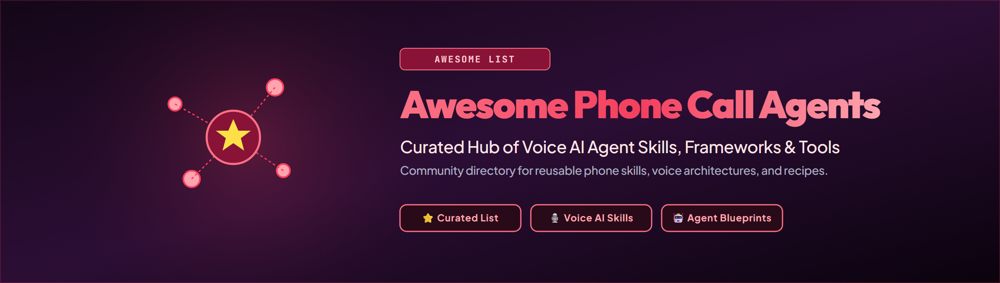

# Awesome Phone Call Agents

<div align="center">

**A community hub for reusable phone-call Agent Skills, runnable apps, workflow plugins, adapters, scheduler recipes, and safety patterns.**

Maintainers provide reference skills, runnable examples, templates, validation, and safety guidance so developers and workflow builders can quickly explore phone-call agent workflows.

[Community contributions](#community-contributions) · [Resources](#resource-list) · [CLI](#cli-reference) · [Templates](#templates) · [Roadmap](docs/roadmap.md) · [Contributing](#contributing) · [Discord](https://discord.gg/6AbXUzUV8w)


</div>

## Community contributions

Awesome Phone Call Agents is an early community hub for developers and workflow builders creating reusable phone-call workflows for AI agents. CALL-E SDKs, provider APIs, authentication, call execution, and provider-side controls belong upstream with CALL-E itself. This repository focuses on the community artifacts around those primitives: Agent Skills, workflow plugins, user-facing apps, examples, templates, and safety patterns.

> [!NOTE]
> New here? Start with the [`call-reminder`](skills/call-reminder/) and [`google-form-callback`](skills/google-form-callback/) skills, use [`outbound-call-skill-creator`](skills/outbound-call-skill-creator/) when you need to generate a focused outbound workflow skill, try the [`python/batch-runner`](apps/python/batch-runner/) app, and read [`docs/roadmap.md`](docs/roadmap.md) for open community directions.

| Contribution area | Good examples | Where to contribute |
| --- | --- | --- |
| Agent Skills | Customer callbacks, appointment confirmation, lead qualification, order exception follow-up, service dispatch, incident escalation | `skills/` |
| Workflow Plugins | Dify tools, n8n nodes, Zapier actions, HubSpot workflow actions, Feishu/Lark automation nodes | `plugins/` |
| User-facing Apps | Call chat, call review console, call scheduler UI, customer callback app, business call workbench | `apps/` |

The community roadmap is a direction guide, not a fixed release plan. Small examples, platform notes, workflow sketches, templates, and focused demos are all useful.

> [!IMPORTANT]
> Phone-call workflows can create real-world side effects. Please keep examples explicit, easy to inspect, safe to try without a real call when possible, and clear about phone numbers, credentials, scheduling, cancellation, and result handling.

## Table of Contents

- [Community contributions](#community-contributions)
- [Why this repository exists](#why-this-repository-exists)
- [CLI reference](#cli-reference)
- [Templates](#templates)
- [Resource list](#resource-list)
- [Contributing](#contributing)
- [Community](#community)
- [License](#license)

## Why this repository exists

AI agents increasingly need to turn phone calls into reusable workflows: reminders, follow-ups, appointment coordination, provider-specific call adapters, scheduler integrations, and safety checks that other agents can install or adapt. Each entry should help an agent package, schedule, execute, or safely operate a real phone-call workflow — not act as a generic voice-agent product, telephony vendor directory, or call-center software list.

This repository focuses on three principles:

1. **Portability**: skills, apps, and adapters should be useful across agent hosts when possible.
2. **Provider separation**: the phone-call provider should place or create calls; the host scheduler should handle recurrence.
3. **Safety by default**: phone numbers, consent, credentials, and medical, legal, financial, or emergency boundaries must be handled explicitly.

## CLI reference

CALL-E CLI parameters and command flags are documented in [`cli-reference.md`](https://github.com/CALLE-AI/call-e-integrations/blob/main/packages/cli/docs/cli-reference.md).

## Templates

### Skill folder template

Use this Agent Skills folder pattern:

```text
skill-name/
├── SKILL.md
├── references/
├── scripts/
└── assets/
```

### App directory template

Use `apps/` for runnable tools and demo apps:

```text
apps/
├── python/
│   └── app-name/
└── typescript/
    └── app-name/
```

Every app that can place a call or create a recurring job must document setup, side effects, cancellation, credential handling, and dry-run or preview behavior.

### Plugin directory template

Use `plugins/` for no-code and low-code workflow-platform plugins:

```text
plugins/
└── plugin-name/
    ├── README.md
    ├── manifest-or-config-file
    └── examples/
```

Every plugin should document supported triggers or actions, required inputs, side effects, credential handling, dry-run or preview behavior, and cancellation or rollback behavior when it can create calls or recurring jobs.

### README list entry template

```markdown
- [Project Name](https://example.com) - One sentence explaining why this is useful for AI-agent phone-call workflows.
```

Keep descriptions short, specific, factual, and directly tied to packaging, scheduling, executing, or safely operating AI-agent phone-call tasks.

Good: `- [call-reminder](skills/call-reminder/) - Scheduler wrapper skill for recurring CALL-E phone-call reminders.`
Avoid: `- [call-reminder](skills/call-reminder/) - A great tool for calling people!` (marketing language, no indication of what it does or how it fits the AI-agent workflow)

## Resource list

This project is an awesome list for AI-agent phone-call workflows. Add resources only when they directly help agents package, schedule, execute, or safely operate phone-call tasks.

### Skills

- [`accesscall`](skills/accesscall/) - Phone-based accessibility intake for VPAT 2.4/Section 508 audits. Run `npm install` in `skills/accesscall/` before using `scripts/format-to-vpat.js`, or it fails with `Cannot find module 'jszip'`.
- [`call-reminder`](skills/call-reminder/) - Scheduler wrapper skill for recurring CALL-E phone-call reminders.
- [`deployment-approval-call`](skills/deployment-approval-call/) - Spoken, code-verified human approval before an agent or pipeline does something irreversible.
- [`voice-preflight`](skills/voice-preflight/) - Hear a call task spoken by your own text-to-speech provider before a real person does, then refuse a script whose critical line would not survive being spoken.
- [`dollar-consent-first-callback`](skills/dollar-consent-first-callback/) - Consent-first owner escalation after a local safety gate blocks an extreme-risk developer action; call results never grant destructive permission.
- [`forgerelay-supplier-clarification`](skills/forgerelay-supplier-clarification/) - Safe, approval-gated CALL-E workflow for collecting missing manufacturing RFQ details from authorized supplier contacts.
- [`google-form-callback`](skills/google-form-callback/) - Google Form response workflow for safe one-off callback calls with dry-runs, scheduling plans, and Sheets writeback. See the [workflow guide](docs/google-form-callback/).
- [`outbound-call-skill-creator`](skills/outbound-call-skill-creator/) - Creator skill for generating focused outbound phone-call workflow skills from Google Forms, TikTok Ads, Notion, Airtable, local CSV files, or custom sources.
- [`service-dispatch-call`](skills/service-dispatch-call/) - Service dispatch workflow that asks a vendor about availability, ETA, and cost, returns a schema-validated result, and routes any commitment to human approval.
- [`calle-script-advisor`](skills/calle-script-advisor/) - Drafts and lints CALL-E call task text and result schemas for clarity, safety, and extraction quality before a call is placed.
- [`verify-by-phone`](skills/verify-by-phone/) - Single disclosed verification call that checks a directory listing against the published line, grounds every answer in a transcript span, and abstains instead of guessing when the call does not establish one.
- [`ringer-consumer-tasks`](skills/ringer-consumer-tasks/) - Compose and safely place the dreaded consumer phone calls (bill negotiation, cancellation, refund, booking, quote comparison, inquiry) as CALL-E tasks with strict result schemas, dry-run-by-default previews, and human-in-the-loop decision authority.

### Apps

- [CallmeMaybe](https://github.com/jongan69/callmemaybe) - Shopify order-exception phone workflows that use CALL-E for carrier traces and consent-first customer callbacks, with a no-call fixture mode and merchant approval before every Shopify mutation.

Runnable demo apps live under [`apps/`](apps/). They are not a CALL-E SDK and do not define a supported application API.

| App | Language | Purpose |
| --- | --- | --- |
| [`apps/web/callproof`](apps/web/callproof/) | Ruby / Python | Closed-loop CALL-E workflow that checks transcript evidence against an immutable call contract and routes policy exceptions to persisted AgentKit human review. |
| [`apps/typescript/kincall`](apps/typescript/kincall/) | TypeScript | Consent-first check-in and trusted-circle coordination: a stated request for help overrides the agent's own judgement, contacts are called one at a time until somebody commits, and the monitored person is called back with the outcome. |
| [`apps/typescript/verify-contact-claim`](apps/typescript/verify-contact-claim/) | TypeScript | Contact-claim verifier for a suspicious voicemail, text or missed call: dials only the number printed on the customer's own card, asks whether that contact was genuine and returns the words that came back with a hash-chained record. |
| [`apps/typescript/call-neuron`](apps/typescript/call-neuron/) | TypeScript | Functional consent-first scholarship outreach prototype with manual/file intake, identity-first disclosure, neutral voicemail, one-recipient CALL-E planning and confirmation, live status, human dispositions, and browser-local campaign data. |
| [`apps/typescript/phone-approval-gate`](apps/typescript/phone-approval-gate/) | TypeScript | Phone-verified approval gate for irreversible automation, with a one-time spoken code, an escalation ladder, dual control and a verifiable approval record. |
| [`apps/typescript/voice-preflight`](apps/typescript/voice-preflight/) | TypeScript | Renders a call task through any text-to-speech API you already pay for so you hear it before the callee does, then refuses a script whose declared critical line has gone missing, whose voice cannot speak the recipient's language or whose measured audio overruns its budget. |
| [`apps/typescript/call-on-behalf`](apps/typescript/call-on-behalf/) | TypeScript | Delegated errand caller with a disclosure budget: says only the details the person authorized, commits only inside authorized windows, and returns the answers plus the transcript. |
| [`apps/typescript/lost-line-coordinator`](apps/typescript/lost-line-coordinator/) | TypeScript | Consent-first lost-property route coordinator with inspectable calls, locally validated feature evidence, adaptive early stopping, and privacy-minimized results. |
| [`apps/typescript/surplus-signal`](apps/typescript/surplus-signal/) | TypeScript | Consent-first surplus-food pickup confirmations with strict structured results and a redacted candidate manifest that still requires human dispatch approval. |
| [`apps/python/freshchain-resolver`](apps/python/freshchain-resolver/) | Python | Resolve delayed cold-chain receiving exceptions by phone and return a safe dispatch decision. |
| [`apps/python/hungrycall-cascade`](apps/python/hungrycall-cascade/) | Python | Sequential call cascade that stops at the first candidate meeting every must and boundary, with staged concessions treated as an authorisation and unknown outcomes halting the run. |
| [`apps/python/researchcall-survey`](apps/python/researchcall-survey/) | Python | Standardized survey runner with a reproducible seeded sample, locked ethics rules, raw answers kept beside their coded category, and completion measured against everyone drawn. |
| [`apps/python/ringedingeding`](apps/python/ringedingeding/) | Python | Multi-recipient response aggregator that keeps answered, refused and unreached apart, reports every share against those who answered, and never reads silence as consent. |
| [`apps/typescript/multi-party-scheduler`](apps/typescript/multi-party-scheduler/) | TypeScript | Two-phase appointment scheduling over phone calls: gather availability, confirm one time with everybody by voice, release everybody who confirmed when the commit fails and resume an interrupted run. |
| [`apps/python/callback-window-coordinator`](apps/python/callback-window-coordinator/) | Python | Consent-first callback-window coordinator with masked preview, stable idempotency, and structured CALL-E results. |
| [`apps/python/callflow-campaign-runner`](apps/python/callflow-campaign-runner/) | Python | CSV-driven outbound campaign runner that triages structured results into auto-closed, retry, and needs-human queues. |
| [`apps/python/batch-runner`](apps/python/batch-runner/) | Python | JSONL batch runner using CALL-E CLI auth state, FastMCP, Rich output, and MCP tool-call metadata. |
| [`apps/python/broker-login-client`](apps/python/broker-login-client/) | Python | CALL-E brokered login client with local token cache and MCP HTTP calls. |
| [`apps/typescript/broker-login-client`](apps/typescript/broker-login-client/) | TypeScript | CALL-E brokered login client using `@call-e/core`. |
| [`apps/typescript/broker-login-client-standalone`](apps/typescript/broker-login-client-standalone/) | TypeScript | CALL-E brokered login client without a shared package dependency. |
| [`apps/python/oauth-login-client`](apps/python/oauth-login-client/) | Python | CALL-E OAuth login client for MCP Streamable HTTP. |
| [`apps/typescript/oauth-login-client`](apps/typescript/oauth-login-client/) | TypeScript | CALL-E OAuth login client for MCP Streamable HTTP. |
| [`apps/typescript/vibehub-founder-relay`](apps/typescript/vibehub-founder-relay/) | TypeScript | Consent-first founder-match readiness call with masked preview, stable idempotency, and structured CALL-E results. |

The default e2e tests use a local fake broker/OAuth/MCP server or dry-run paths, so they do not require real CALL-E credentials or browser login. Live verification is opt-in in each app README.

### Plugins

No-code and low-code workflow plugins live under [`plugins/`](plugins/). They are for workflow-platform nodes, actions, connectors, and recipes that help operators connect business events to phone-call agent workflows without writing a full app.

Plugins should be explicit about inputs, outbound call side effects, credential handling, preview or dry-run behavior, and how a workflow builder can disable or roll back the integration.

| Plugin | Platform | Purpose |
| --- | --- | --- |
| [`plugins/n8n-calle-api`](plugins/n8n-calle-api/) | n8n | Importable CALL-E API workflow template for one-by-one outbound calls, metadata round trips, call status signals, transcripts, summaries, and structured results. |
| [`plugins/n8n-nodes-calle`](plugins/n8n-nodes-calle/) | n8n | Documentation-only pointer to the standalone `@call-e/n8n-nodes-calle` community node package for native outbound-call nodes. |
| [`plugins/dify-template`](plugins/dify-template/) | Dify | Importable Dify workflow DSL template for a one-shot outbound call tool with dry-run preview, API health gating, and masked results. |
| [`plugins/hubspot-calle`](plugins/hubspot-calle/) | HubSpot | Static HubSpot Projects app for creating CALL-E call tasks from CRM records and workflow App Cards. |
| [`plugins/zapier-calle`](plugins/zapier-calle/) | Zapier | Zapier Platform CLI integration for outbound CALL-E calls with callback-based waiting, fail-closed dispositions, dry-run preview, and payload-derived idempotency keys. |

### Safety patterns

- [`Safety reference`](skills/call-reminder/references/safety.md) - Consent, E.164 phone-number handling, credential boundaries, cancellation, duplicate-job prevention, and medical reminder boundaries.
- [`Dispatch safety reference`](skills/service-dispatch-call/references/safety.md) - Purpose-bound authorization, third-party privacy on outbound calls, the commitment boundary between gathering an answer and accepting it, and retention limits on transcripts and spoken values.
- [`Ambiguous outcome handling`](skills/service-dispatch-call/references/ambiguous-outcomes.md) - Why an unknown call outcome is a state to reconcile rather than an error to retry, and how client timeouts cause duplicate calls.
- [`Idempotency reference`](skills/service-dispatch-call/references/idempotency.md) - Deriving call idempotency keys from the authorization rather than the attempt, reserving before dialling, and replay-safe webhook handling.
- [`Approval threat model`](apps/typescript/phone-approval-gate/docs/threat-model.md) - What a phone approval proves and does not prove, out-of-band secret handling, and why the phone network is a restricted verification channel.
- [`Disclosure budget`](apps/typescript/call-on-behalf/docs/privacy-budget.md) - Authorizing what a caller may say about a person, checking the script before the call and checking what was actually said after it.
- [`Contact-claim limits`](apps/typescript/verify-contact-claim/docs/limits.md) - Why an institution refusing to confirm a contact is the expected outcome, what a confirmed contact still does not prove and what has never been tested live.
- [`Provider descriptors`](apps/typescript/voice-preflight/docs/providers.md) - How one HTTP client drives any text-to-speech API from a JSON file, where the audio sits in a response, plus the order in which a run refuses so a failure says what has already happened.
- [`Design principles`](docs/design-principles.md) - Repository-wide architecture principles for safe phone-call workflows.
- [`Fail-closed dispositions`](plugins/zapier-calle/docs/fail-closed-dispositions.md) - Classifying phone-call outcomes so ambiguity, low confidence, and unrecognized statuses route to a human instead of a success branch.

## Contributing

See [`CONTRIBUTING.md`](CONTRIBUTING.md) for the full contribution guide.

### Contribution workflow

1. Choose a scoped contribution: skill, app, provider adapter, scheduler recipe, automation pattern, safety pattern, or reference implementation.
2. Confirm it directly helps AI agents package phone-call workflows.
3. Use the templates above for skill folders, app directories, adapter records, or README entries.
4. Add setup, usage, side-effect, and cancellation notes.
5. Use fictional or masked phone numbers in samples.
6. Keep repository-facing content in English.
7. Follow [`docs/git-naming-conventions.md`](docs/git-naming-conventions.md) for branch names, commit messages, and pull request titles.
8. Run validation before opening a pull request.

```bash
python3 scripts/validate_repository.py
```

High-quality additions should include a short description, compatibility notes, safety notes for real-world side effects, setup or install instructions, tests, cancellation or rollback behavior for recurring workflows, and no secrets or personal data.

Out of scope:

- generic telephony vendor directories
- marketing-only pages
- call-center software lists without an AI-agent workflow
- tools that require unsafe credential handling
- resources that hide phone calls, recurring jobs, or external side effects from the user

## Community

- Discord: [https://discord.gg/6AbXUzUV8w](https://discord.gg/6AbXUzUV8w)

## License

MIT. See [`LICENSE`](LICENSE).
